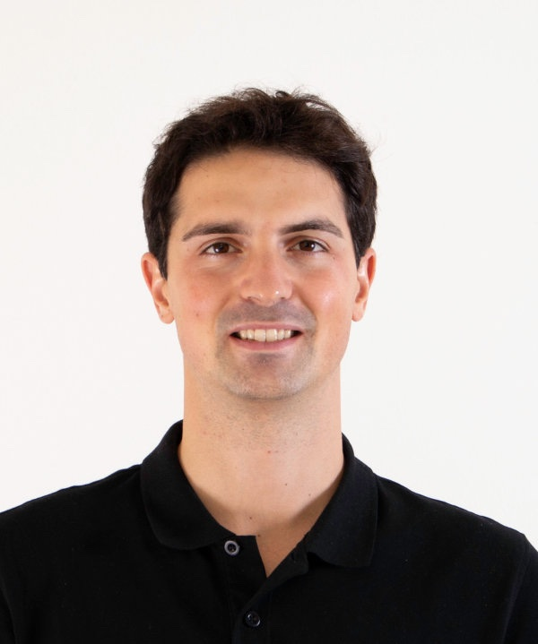

    
    

      <h2>Antonello Cherubini</h2>
      
<strong>Job Title:</strong> Researcher

      
<strong>Bio:</strong> Antonello Cherubini graduated in mechanical engineering from the Politecnico di Milano, Milan, Italy,in 2012, and the Ph.D. degree in robotics from the Sant’Anna University of Pisa, Pisa, Italy, in 2017.   He is currently an Assistant Professor (RTDA) with the University of Trento, Trento, Italy. He has been a Visiting Research Fellow with TU Delft, Delft, The Netherlands, and a Visiting Professor with the University Carlos III of Madrid, Getafe, Spain.   Dr. Cherubini’s Ph.D. thesis won the Prize Bernardo Nobile.

    

