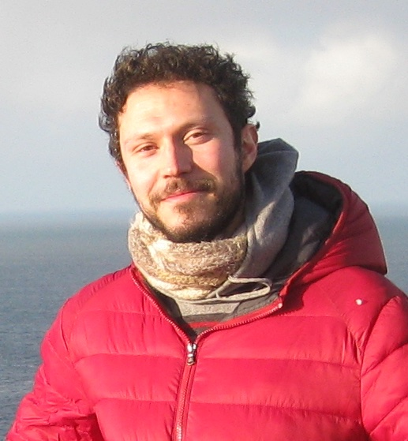

  <h2>Professor and senior members</h2>
  

    

      <a href="/People/MauroDaLio">
        

          
        

      </a>
       
      <a href="/People/MauroDaLio"> Mauro Da Lio </a>
       
      Full Professor
    

    

      <a href="/People/EnricoBertolazzi">
        

          
        

      </a>
       
      <a href="/People/EnricoBertolazzi"> Enrico Bertolazzi </a>
       
      Associate Professor
    

    

      <a href="/People/FrancescoBiral">
        

          
        

      </a>
       
      <a href="/People/FrancescoBiral"> Francesco Biral </a>
       
      Associate Professor
    

    

      <a href="/People/GastonePietroRosatiPapini">
        

          
        

      </a>
       
      <a href="/People/GastonePietroRosatiPapini"> Gastone Pietro   Rosati Papini </a>
       
      Associate Professor
    

    

      <a href="/People/AntonelloCherubini">
        

          
        

      </a>
       
      <a href="/People/AntonelloCherubini"> Antonello Cherubini </a>
       
      RTdA
    

  

  <h2>Active members</h2>
  

    

      <a href="/People/AlicePlebe">
        

          
        

      </a>
       
      <a href="/People/AlicePlebe"> Alice Plebe </a>
       
      Post-doc
    

    

      <a href="/People/MattiaPiazza">
        

          
        

      </a>
       
      <a href="/People/MattiaPiazza"> Mattia Piazza </a>
       
      PhD Student
    

    

      <a href="/People/SebastianoTaddei">
        

          
        

      </a>
       
      <a href="/People/SebastianoTaddei"> Sebastiano Taddei </a>
       
      PhD Student
    

    

      <a href="/People/MatteoLarcher">
        

          
        

      </a>
       
      <a href="/People/MatteoLarcher"> Matteo Larcher </a>
       
      PhD Student
    

    

      <a href="/People/MattiaPiccinini">
        

          
        

      </a>
       
      <a href="/People/MattiaPiccinini"> Mattia Piccinini </a>
       
      PhD Student
    

    

      <a href="/People/DavideStocco">
        

          
        

         
      </a>
      <a href="/People/DavideStocco"> Davide Stocco </a>
       
      PhD Student
    

  

  <h2>Former members</h2>
  

    

      <a href="/People/EdoardoPagot">
        

          
        

      </a>
       
      <a href="/People/EdoardoPagot"> Edoardo Pagot </a>
       
      Research fellow
    

  

  