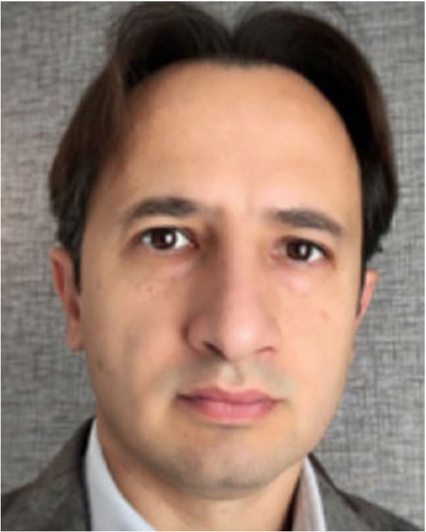
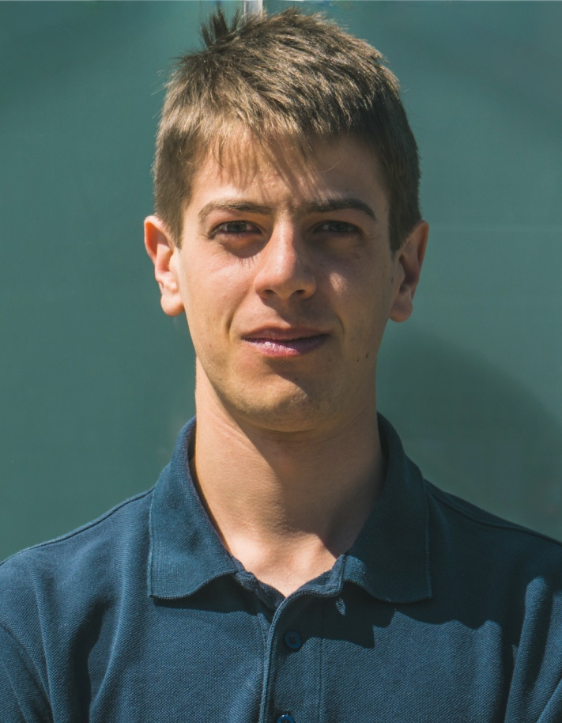

# Our research group

    
    

      <h2>Francesco Biral</h2>
      
<strong>Job Title:</strong> Professor

      
<strong>Bio:</strong> Francesco Biral received the master’s degree in mechanical engineering from the University of Padova, Italy, and the Ph.D. degree in mechanism and machine theory from the University of Brescia, Italy, in 2000 for his work on minimum lap time of racing vehicles with the use of optimal control. He is currently an Associate Professor with the Department of Industrial Engineering at the University of Trento. His research interests include symbolic and numerical multi-body dynamics and optimization, constrained optimal control, mainly in the field of vehicle dynamics with special focus on intelligent vehicles and optimal maneuver for racing vehicles. He has 15 years experience in the development and validation of ADAS and AD functions, both for cars and PTWs, gained in several European and industrial funded research projects.

    

    
    

      <h2>Enrico Bertolazzi</h2>
      
<strong>Job Title:</strong> Professor

      
<strong>Bio:</strong> Enrico Bertolazzi ...

    

## Active members

    
    

      <h2>Mattia Piazza</h2>
      
<strong>Job Title:</strong> PhD Student

      
<strong>Bio:</strong> Francesco Biral Mattia Piazza is a doctoral researcher at the University of Trento (Italy), where he received his master’s degree in Mechatronics Engineering and a research fellowship grant to work on minimum-time optimal control problems for racing vehicles. He is currently working on autonomous driving and optimization for racing and urban scenarios.

    

    
    

      <h2>Sebastiano Taddei</h2>
      
<strong>Job Title:</strong> PhD Student

      
<strong>Bio:</strong> Sebastiano Taddei received a Bachelor's Degree in Industrial Engineering from the University of Trento in 2020, and a double Master's Degree in Mechatronics Engineering (University of Trento) and ICT Innovation (Aalto University) in 2022. He is currently a Ph.D. student of the DAUSY national Ph.D. program at the University of Trento coordinated by the Politecnico di Bari. His research interests lie in automated driving for both urban and racing applications, as well as vehicle dynamics and modeling.

    

    
    

      <h2>Matteo Larcher</h2>
      
<strong>Job Title:</strong> PhD Student

      
<strong>Bio:</strong> Matteo Larcher received a master’s degree in mechatronics engineering at the University of Trento, where he is currently working on vehicle dynamic models for real-time applications as part of his PhD research program. His research interests are multi-body modeling of mechanical systems and hardware-in-the-loop simulations.

    

    
    

      <h2>Mattia Piccinini</h2>
      
<strong>Job Title:</strong> PhD Student

      
<strong>Bio:</strong> Mattia Piccinini received a B.Sc. in industrial engineering and an M.Sc. in mechatronics engineering, both cum laude and both from the University of Trento, Italy, respectively in 2017 and 2019. He is currently a Ph.D. student at the University of Trento, Italy. From March to June 2022, he was a visiting Ph.D. student at the Universität der Bundeswehr, Munich, Germany. His research focuses on motion planning, control and state estimation methods for racing autonomous vehicles.

    

>

    
    

      <h2>Davide Stocco</h2>
      
<strong>Job Title:</strong> PhD Student

      
<strong>Bio:</strong> Davide Stocco ...

    

    
    

      <h2>Edoardo Pagot</h2>
      
<strong>Job Title:</strong> PhD, Researcher

      
<strong>Bio:</strong> Edoardo Pagot ...

    

